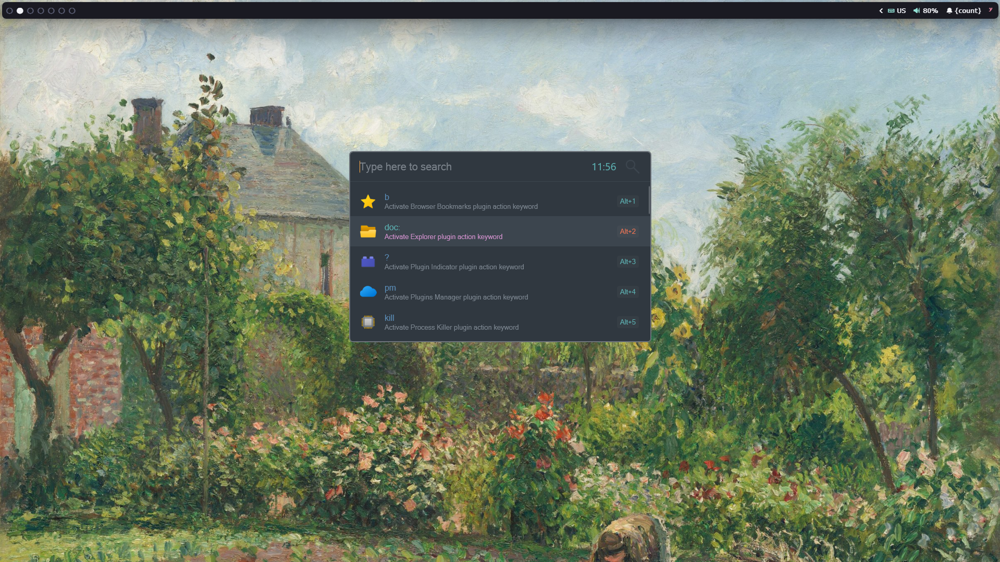
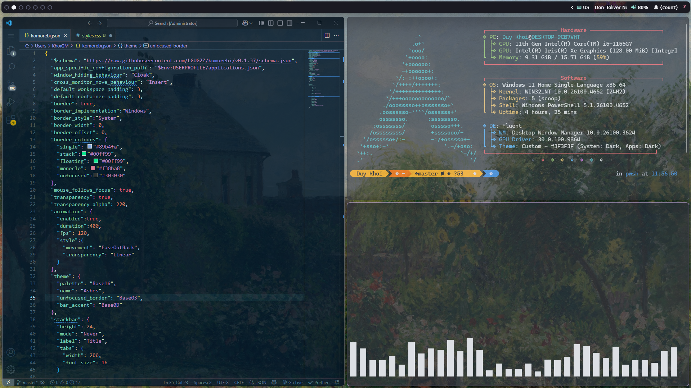

# My current desktop

# Used
- **Topbar:** [yasb](https://github.com/amnweb/yasb) with my [config](configs/yasb)
- **WM:** [komorebi](https://github.com/LGUG2Z/komorebi) with my [config](configs/komorebi.json)
- **command-line system information:** [fastfetch](https://github.com/fastfetch-cli/fastfetch) with my [config](configs/fastfetch.json)
- **CLI:** [Oh-My-Posh](https://ohmyposh.dev/) / [Github](https://github.com/JanDeDobbeleer/oh-my-posh)
